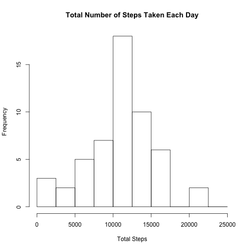
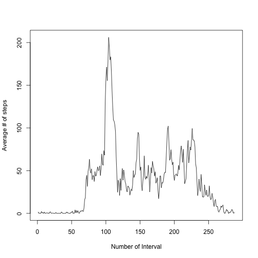
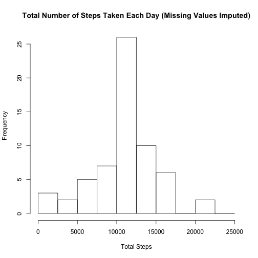
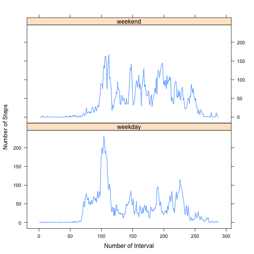

## Loading and preprocessing the data

### Read in the data set.

After unzipping the file, we read the data in and assign the correct class to each column. The dates are conveniently stored in the default form YYYY-MM-DD so we don't need any special arguments to convert that column to class Date. 


```r
unzip("activity.zip")
raw_data <- read.csv("activity.csv", header=TRUE, stringsAsFactors=FALSE,
                          colClasses=c("integer", "Date", "integer"))
```
Let's see what the data looks like:

```r
head(raw_data)
```

```
##   steps       date interval
## 1    NA 2012-10-01        0
## 2    NA 2012-10-01        5
## 3    NA 2012-10-01       10
## 4    NA 2012-10-01       15
## 5    NA 2012-10-01       20
## 6    NA 2012-10-01       25
```

## What is the mean total number of steps taken per day?
We're told that we can ignore the missing values for this part.
It appears that the only column to have missing values is the steps column:

```r
c(any(is.na(raw_data$steps)), any(is.na(raw_data$date)), any(is.na(raw_data$interval)))
```

```
## [1]  TRUE FALSE FALSE
```

For this question, since we're told to ignore missing values, we'll keep only the complete cases:

```r
completedata <- raw_data[complete.cases(raw_data), ]
```
To calculate the total number of steps taken per day we want to take the
sum of the steps column, grouped by date.

```r
totalsteps <- tapply(completedata$steps, completedata$date, sum)
```

### Histogram of total number of steps taken each day.

Here's a histogram of the total number of steps taken each day. I 
played with the "breaks" argument until I liked the histogram.

```r
hist(totalsteps, breaks=seq(0, 25000, by=2500),
     xlab="Total Steps", main="Total Number of Steps Taken Each Day")
```

 

### Calculate mean and median of total number of steps taken per day:

```r
mean(totalsteps)
```

```
## [1] 10766.19
```

```r
median(totalsteps)
```

```
## [1] 10765
```

## What is the average daily activity pattern?

### Time series plot of average number of steps taken

We make a time series plot of the 5-minute interval (x-axis) and the average number of steps taken, averaged across all days (y-axis). 

The x-axis is labeled by which interval of the day it is, from 1 to 288 (because the number of minutes in a day is (60 minutes per hour) * (24 hours per day) = 1440, and then (1440 minutes per day) / (5 minutes per interval) = 288 intervals per day).

Converting the interval directly to an integer and using that on the x-axis would result in an incorrect and funny-looking graph. For example, we have interval 55 for 00:55am, and then interval 100 for 1:00am.  If we tried to graph using a direct translation of the intervals to integers, this would give us a point with x=55 and  a point with x=100, but no points in between, creating artificial straight line segments in the graph.

Since the activity data frame is in order by interval, we can just create a sequence from 1:288 for the x values.


```r
# Compute the average steps, grouped by interval
activity <- as.data.frame(tapply(completedata$steps, completedata$interval, mean))
names(activity) <- c("average")
# The row names of the activity data frame are now the intervals. 
# Confirm that these row names, interpreted as integers, are in order.
all(row.names(activity)==sort(as.integer(row.names(activity))))
```

```
## [1] TRUE
```

```r
# Add a column for which number interval it is
activity$intervalnum <- seq(along.with=activity$average)
# Plot
plot(activity$intervalnum, activity$average, type='l', 
     xlab="Number of Interval", ylab="Average # of steps", xlim=c(1,288))
```

 

### Which 5-minute interval, on average across all the days in the dataset, contains the maximum number of steps?

```r
# Find the maximum average steps
maxnum <- max(activity$average) 
# Find the interval(s) that take that value. The row names are the intervals, 
# but let's make a column named interval for ease later.
activity$interval <- row.names(activity)
indices <- which(activity$average==maxnum)
activity$interval[indices]
```

```
## [1] "835"
```
It appears to be interval 835, corresponding to the five-minute interval starting at 8:35am.

## Imputing missing values

There are a number of days/intervals where there are missing values (coded as NA). The presence of missing days may introduce bias into some calculations or summaries of the data.

To calculate the total number of missing values in the dataset (i.e. the total number of rows with NAs) take the number of rows we read initially minus the number of complete rows:

```r
dim(raw_data)[1]-dim(stepdata)[1]
```

```
## [1] 2304
```
Or, we could directly sum the number of rows where steps is NA. It's a nice sanity check to do the same thing two different ways.

```r
sum(is.na(raw_data$steps))
```

```
## [1] 2304
```

### Strategy for filling in missing values
To fill in the missing values we'll use the mean for that 5-minute interval, since we've already computed those values.

Create a new dataset that is equal to the original dataset but with the  missing data filled in:

```r
new_data <- raw_data
# Add a column which includes the interval average.
new_data$interval_av <- sapply(new_data$interval, 
                               function(x){
                                    index <- which(activity$interval==x)
                                    activity$average[index]
                                })
# Fix the values: If the value of steps is NA replace it with the interval average, 
# otherwise leave it alone.
new_data$fixed_steps <- ifelse (is.na((new_data$steps)), new_data$interval_av, new_data$steps)
```

### Histogram of the total number of steps taken each day, with missing values imputed

Recompute the histogram of the total number of steps taken each day, now that missing values are filled in. It has the same shape as the first histogram, but the frequencies are larger
because we now have more days with step counts.

```r
new_totalsteps <- tapply(new_data$fixed_steps, new_data$date, sum)
hist(new_totalsteps, breaks=seq(0, 25000, by=2500),
     xlab="Total Steps", main="Total Number of Steps Taken Each Day (Missing Values Imputed)")
```

 

Compute the mean and median total number of steps taken per day, now that missing values are filled in:

```r
mean(new_totalsteps)
```

```
## [1] 10766.19
```

```r
median(new_totalsteps)
```

```
## [1] 10766.19
```

The mean is the same as it was before missing values were filled in, while the median has changed slightly. Let's think about why this should make sense.

### Why is the mean the same and the median different?

First let's understand where we filled in missing values. We look at the dates with values of NA in the "steps" field. For each of these dates, it turns out that all the step values were NA. We'll call these the "missing data" days. There are 8 of them.


```r
# For which dates did we have NA values?
dates_with_na <- unique(new_data$date[which(is.na(new_data$steps))])
length(dates_with_na)
```

```
## [1] 8
```

```r
# get the data from those dates, and see if ALL the data on those dates was NA
all(is.na(new_data[new_data$date %in% dates_with_na,]$steps))
```

```
## [1] TRUE
```

#### Why the mean didn't change

Now, how did we compute the mean total steps per day when we were ignoring missing values?

The mean total number of steps per day is given by the formula
$$ \frac{1}{n} \left(\sum_{d=1}^{n} \sum_{i=1}^{288} x^d_i \right)$$
where $n$ is the number of days (with no missing data) and $x^d_i$ is the number of steps taken on day $d$ during interval $i$.  The inner summation adds up the steps for each interval during day $d$ to find the total number of steps taken on day $d$. The outer summation adds up the total number of steps on each day, over all days. Finally we divide by $\frac{1}{n}$ to find the average total steps taken per day.

Since the summations are finite, we can swap them and distribute the coefficient $\frac{1}{n}$ to get the equivalent formula
$$\sum_{i=1}^{288} \left(\frac{1}{n} \sum_{d=1}^{n} x_i^d\right).$$
This is still the mean total number of steps per day.  However, now the inner sum is taken over all days while interval $i$ is held fixed.  The multiplication by $\frac{1}{n}$ gives the mean number of steps taken during interval $i$ over all days. The outer sum takes the total, over all intervals, of the mean number of steps per interval.

For the missing data days, we filled in the missing data for each interval by setting it equal to the mean number of steps taken on that interval (where the mean was taken over all the days that had data). Since *all* the data was missing on the missing data days, the number of steps for each interval $i$ was filled in with 
$$\left(\frac{1}{n} \sum_{d=1}^{n} x_i^d\right).$$
When we take the sum over all intervals, we find that the total number of steps taken on a missing data day will now come out to be
$$\sum_{i=1}^{288} \left(\frac{1}{n} \sum_{d=1}^{n} x_i^d\right).$$
As shown above, this is exactly the mean total steps we computed *before* filling in the missing data.

To summarize: the total number of steps taken on a "missing data" day will now come out to be the same as the mean number of total steps per day we calculated when we were ignoring missing data.

We can confirm in R that each of the missing data days now has the same total number of steps after we fill in the missing data:

```r
# Compute the indices with missing data
indices_with_na <-new_data$date %in% dates_with_na
# Confirm that ALL the data was missing on those days - ie the only value we see is "NA"
unique(new_data$steps[indices_with_na]) 
```

```
## [1] NA
```

```r
# Confirm that each of these dates has the same total number of steps:
unique(tapply(new_data$fixed_steps[indices_with_na], new_data$date[indices_with_na], sum))
```

```
## 2012-10-01 
##   10766.19
```

The only thing left is to show that if we have $n$ numbers with average $\mu$ and we combine them with 8 copies of $\mu$, the average won't change. Call the $n$ numbers $t_1, \dots t_n$.  Then by definition
$$\frac{1}{n}\sum_{i=1}^n t_i=\mu$$
so
$$\sum_{i=1}^n t_i = \mu n.$$
If we toss in 8 copies of $\mu$ and take the mean of the new collection, we are now finding the average of $n+8$ numbers and we get
$$\frac{1}{n+8}\left(\sum_{i=1}^n t_i + 8\mu\right) = \frac{1}{n+8}\left(n\mu + 8\mu\right)$$
which simplifies to
$$\frac{1}{n+8}\cdot\mu (n+8) = \mu.$$
Thus, the mean does not change when we recompute it for all days with the missing data filled in via the method described above.

#### Why the median did change

The median is the "middle" number. There were originally 53 days with data, and so if we sort the data the median is position 27. We can also look at the numbers to either side of the median.


```r
# This is the original median
sort(totalsteps)[27]
```

```
## 2012-11-12 
##      10765
```

```r
# Here are the numbers to either side of it
sort(totalsteps)[26:28]
```

```
## 2012-11-02 2012-11-12 2012-10-07 
##      10600      10765      11015
```

The median of the original data was 10765  and the next largest value was 11015. The mean of the new data, after we fill in the missing data days, is $\mu=10766.19$:

```r
mean(new_totalsteps)
```

```
## [1] 10766.19
```

When we fill in the missing data days, we're adding 8 copies of $\mu$ to the list of total steps taken per day.  In the new sorted list, these will occur 
after the old median but before any of the other values. Originally we had
$$ t_1, \dots, t_{25}, 10600, 10765, 11015, t_{28}, \dots, t_{53}.$$

After replacing missing values the sorted list of total steps values is 
$$ t_1, \dots, t_{25}, 10600, 10765, \mu, \mu, \mu, \mu, \mu, \mu, \mu, \mu, 11015, t_{28}, \dots, t_{53}.$$
This new list is $53+8=61$ elements long. The new median, or "middle number," is now the 31st element,  shown in parentheses:
$$ t_1, \dots, t_{25}, 10600, 10765, \mu, \mu, \mu, (\mu), \mu, \mu, \mu, \mu, 11015, t_{28}, \dots, t_{53}.$$

We see it makes sense that the median changed.


## Are there differences in activity patterns between weekdays and weekends?

We use the dataset with the filled-in missing values. 

First, create a new factor variable in the dataset with two levels – “weekday” and “weekend” indicating whether a given date is a weekday or weekend day.

```r
# If the day is Saturday or Sunday it's a weekend, otherwise it's a weekeday.
new_data$typeofday <- ifelse(weekdays(new_data$date) %in% c("Saturday", "Sunday"), "weekend", "weekday")
new_data$typeofday <- factor(new_data$typeofday)
```

### Panel plot for average number of steps on weekdays vs weekends
Now make a panel plot containing a time series plot of the 5-minute interval (x-axis) and the average number of steps taken, averaged across all weekday days or weekend days (y-axis). 


```r
# Have to recompute averages with values grouped by both interval and whether it's a weekday or weekend.
avpertype <- with(new_data, tapply(fixed_steps, INDEX=list(interval, typeofday), FUN=mean))
avpertype <- as.data.frame(avpertype)
# Add a column including which number interval each row is
avpertype$intervalnum <- sapply(row.names(avpertype),
                                    function(x) {
                                    index <- which(activity$interval==x)
                                    activity$intervalnum[index]
                                })
# Reshape the dataframe so that we have a column with type of day 
# that the lattice package can use for grouping data.
library(reshape2)
library(lattice)
toplot <- melt(avpertype, id=c("intervalnum"))
names(toplot) <- c("intervalnum", "typeofday", "avsteps")
xyplot(avsteps ~ intervalnum | typeofday, data=toplot, type='l', 
       xlab="Number of Interval", ylab="Number of Steps", layout=c(1,2))
```

 

This looks reasonable.  On weekends people start taking steps later in the day (maybe they sleep in), and then they take steps throughout the day.  On weekdays there's a big spike possibly corresponding to when people would likely be going to work, and then not as many steps in the middle of the day (when they're probably at a desk) as there are on weekends. 
